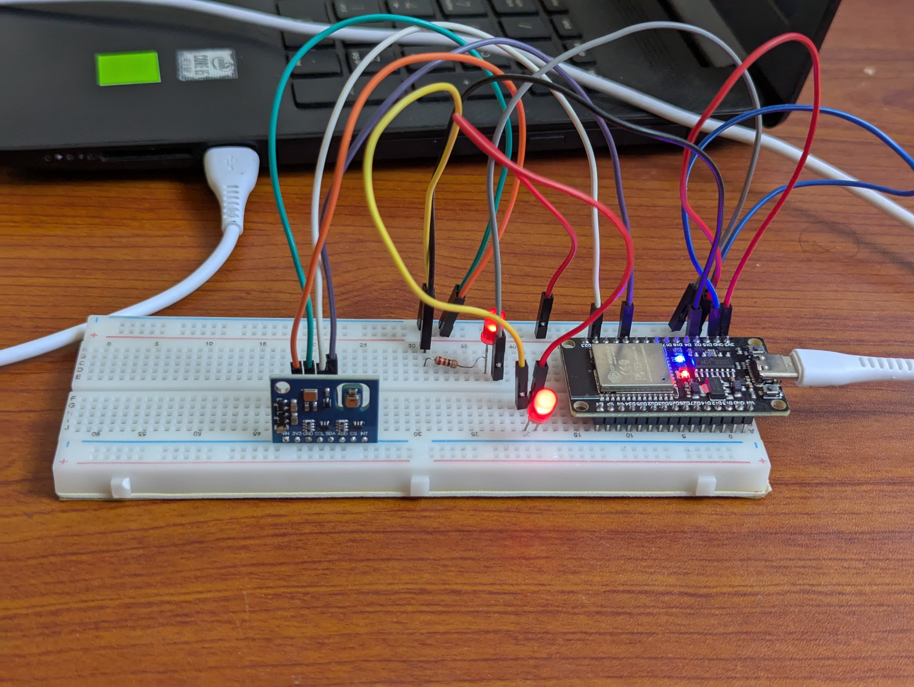

# Indoor Air Quality Monitoring System - Flutter UI

## Overview
This Flutter-based mobile application provides an interactive user interface for an indoor air quality monitoring system. It displays real-time environmental data, including humidity, temperature, total volatile organic compounds (TVOC), and CO₂ concentration, allowing users to monitor and manage indoor air quality effectively.

## Features
- **Dashboard**: Displays an overview of air quality parameters with color-coded alerts.
- **eCO₂ Monitoring**: Shows real-time equivalent CO₂ levels with classification and historical trends.
- **Humidity Tracking**: Displays humidity percentage with classification and a trend graph.
- **Temperature Monitoring**: Provides real-time temperature data with comfort level classification.
- **TVOC Detection**: Monitors total volatile organic compounds and categorizes air quality.

### Software Requirements
- **PlatformIO**: For ESP32 programming.
- **Python**: For data flow simulation.
- **Flutter**: For mobile app development.
- **VSCode**: As the code editor.
- **EMQX MQTT Broker**: For real-time data communication.

### Hardware Requirements
- **ESP32 Microcontroller**: For data acquisition and transmission.
- **ENS160 Sensor**: Measures eCO₂ and TVOC levels.
- **AHT21 Sensor**: Measures temperature and humidity.
- **Power Supply**: 5V power adapter or battery pack for the ESP32.
- **Jumper Wires**: For connecting sensors.
- **Breadboard**: For circuit assembly.
- **Wi-Fi Module**: Built into the ESP32 for communication.
- **Casing/Enclosure**: For protecting the device.
- **LED Indicators**: To indicate status.

## User Interfaces

### 1. Dashboard
The dashboard provides a quick overview of indoor air quality, displaying key environmental parameters such as humidity, temperature, TVOC, and CO₂ levels. Each parameter is shown on a separate card with its corresponding value and unit. An alert box highlights potential air quality issues using color-coded warnings, helping users make informed decisions.

### 2. Equivalent Carbon Dioxide (eCO₂)
This screen displays real-time data on eCO₂ levels in parts per million (ppm). A large green bar highlights the current eCO₂ level along with an air quality classification (e.g., "Good"). A line graph below tracks changes in eCO₂ over time, allowing users to analyze trends and take necessary actions to maintain air quality.

### 3. Humidity
The humidity interface presents real-time humidity percentage along with a classification such as "Dry." A large orange gauge at the top gives an immediate visual representation of humidity levels. Below it, a line graph shows fluctuations in humidity over time, helping users monitor trends and adjust indoor conditions accordingly.

### 4. Temperature
This screen provides real-time temperature readings in degrees Celsius (°C) along with a comfort level classification (e.g., "Comfortable"). A highlighted temperature display at the top ensures quick readability, while a line graph below tracks temperature changes over time. Users can analyze temperature trends and adjust ventilation or climate control systems accordingly.

### 5. Total Volatile Organic Compounds (TVOC)
The TVOC interface monitors indoor air pollution by displaying real-time TVOC levels in parts per billion (ppb). A green display at the top highlights the current TVOC level with an air quality classification (e.g., "Good"). A line graph below visualizes TVOC fluctuations over time, helping users identify potential sources of pollution from household products and take preventive measures.

### 6. Circuit Image

